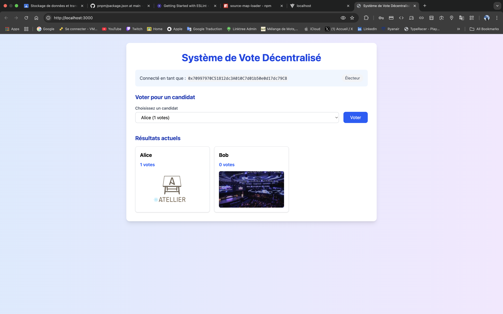

# Système de Vote Décentralisé (Decentralized Voting System)

Developed by **Mohamed Lakssir**

This project is a decentralized voting application built with Solidity smart contracts and a React frontend. It allows users to participate in voting for candidates in a transparent and secure way using blockchain technology.

## Features

- **Connect with MetaMask**: Users can connect their Ethereum wallet to interact with the voting system
- **Admin Interface**: The contract owner has special privileges to add candidates
- **Candidate Management**: Admins can add candidates with names and images
- **Secure Voting**: Each address can only vote once to ensure fairness
- **Image Storage**: Candidate images are stored on IPFS for decentralized content hosting
- **Real-time Results**: See voting results update in real-time
- **Modern UI**: Clean, responsive design using TailwindCSS

## Project Structure

- `/contracts`: Solidity smart contracts
  - `Voting.sol`: Main contract handling candidate registration and voting logic
- `/client`: React frontend application
  - Built with Vite, React and TailwindCSS
  - Connects to the Ethereum blockchain via ethers.js
  - Stores images on IPFS

## Setup and Installation

### Prerequisites

- Node.js & npm/pnpm
- MetaMask browser extension
- IPFS daemon (for image storage)

### Smart Contract Deployment

```shell
# Install dependencies
npm install

# Start a local Hardhat node
npx hardhat node

# Deploy the Voting contract
npx hardhat run scripts/deploy.js --network localhost

# After deployment, copy the contract address from the terminal output
# Contract deployed to: 0x...
```

### Update Contract Address

After deploying the contract, you need to update the contract address in your frontend:

1. Open `/client/src/App.jsx`
2. Find the line with `const CONTRACT_ADDRESS = "0x5FbDB2315678afecb367f032d93F642f64180aa3";`
3. Replace the address with your newly deployed contract address

### Frontend Setup

```shell
# Navigate to the client directory
cd client

# Install dependencies (using pnpm)
pnpm install
# OR using npm
npm install

# Start the development server (using pnpm)
pnpm dev
# OR using npm
npm run dev
```

## Usage

1. Connect your MetaMask wallet to the application
2. If you're the contract owner, you'll have access to the admin panel
3. Admins can add candidates with names and upload candidate images
4. Users can vote for their preferred candidate (one vote per address)
5. Results are displayed in real-time in the results section

## Application Screenshot



## Technologies Used

- **Blockchain**: Ethereum, Solidity, Hardhat
- **Frontend**: React, Vite, TailwindCSS
- **Web3 Integration**: ethers.js
- **Storage**: IPFS for decentralized image storage
